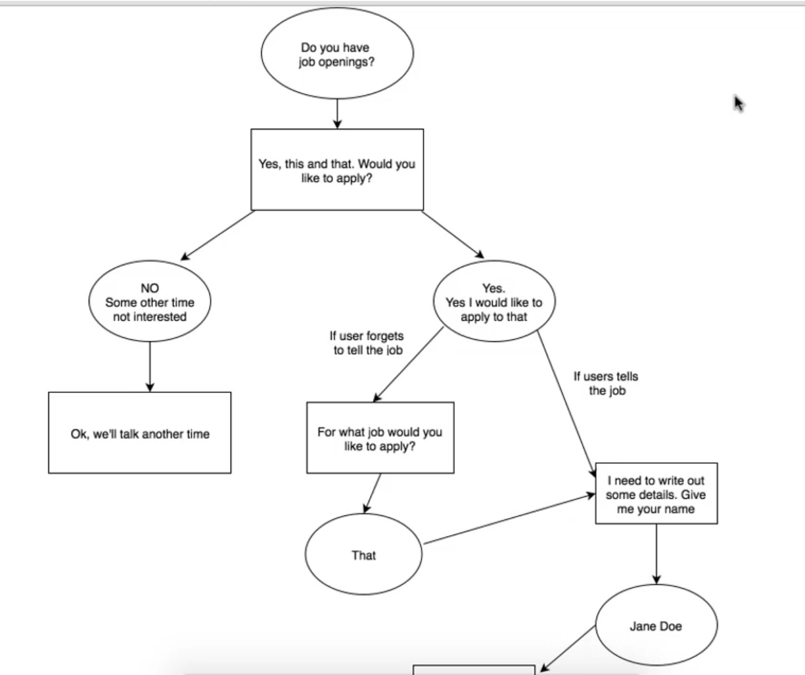

### Section 4: Teaching a bot to have Dialogs - 25.12.2019

+ Entities: helper with intents
  
+ open Dialogflow:
  + add Entity: name = job-vacancy
  + add entry: Accountant = Accountant, Bookkeeper
  + add entry: Shop assistant = Shop assistant, Sales person, ...
  + save
  + add intent: 
    + name: job
    + Traning phrases: Do you have an open job, Is there a job vacancy in your store?, ...
    + Action: job-enquiry
    + Responses: Facebook Messenger text = We're currently looking for new staff. Would you like to apply for assistent or accountant?, You have come at the right time we are looking for a new sales assistant and we need a good accountant. Please select job position. Assistant or accountant?
    + Add response: Quick replies = Accountant, Sales Assistant, Not Interested

+ Context: to create a proper dialog, without the questions asked before would be useless

#### First Dialog Structure:

+ add context:
  + add ouput context: job
+ add new intent:
  + name: job-apply
  + add input context: job
  + add output context: job_application
  + add Training phrase: "I want to apply as an accountant", "I am interested in a sales job", "Please take my application for a sales assistant.",
    "Yes, as an accountant.", "I want to apply now.", "Yes, I'm interested"

Dialogflow should already be highlighting some keywords like accountant, because it knows that is an field for the object we created. Dialogflow should also have created a parameter for these keywords

+ check required field at the auto generated paramater (job-vacancy)
+ add prompts: "For what position do you want to apply", "What job are you interested int"
+ add Facebook Messenger Text Response: "Great! I'll need some information from you. Write OK, when you're ready." 
+ save intent

+ add intent: job-application-details
+ add Input Context: job_application
+ add Training Phrase: "OK"
+ add Paramter:
  + check required
  + name: user-name
  + entity: @sys.any
  + define prompts: "Can you write your name?", "Tell me your name."

Why Entity @sys.any and not @sys.given-name? Because Dialogflow only would recognise English names, otherones would be ignored. Wit @sys.any anything given is going to be stored as the user-name

+ add another parameter: 
  + check required
  + name: previous-job
  + entity: @sys.any
  + define prompts: "What is your current job position", "Where are your working now?", "What is your current job title?"

+ add another parameter:
  + check required
  + name: years-of-experience
  + entity: @sys.any
  + define prompts: "How many years of experience do you have?", "Tell me how many years of experience do you have in this job field?"

+ add another parameter:
  + check required
  + name: phone-number
  + entity: @sys.any
  + define prompts: "Tell me your phone number?", "At what number can we reach you?", "Can you give me your phone number?"

