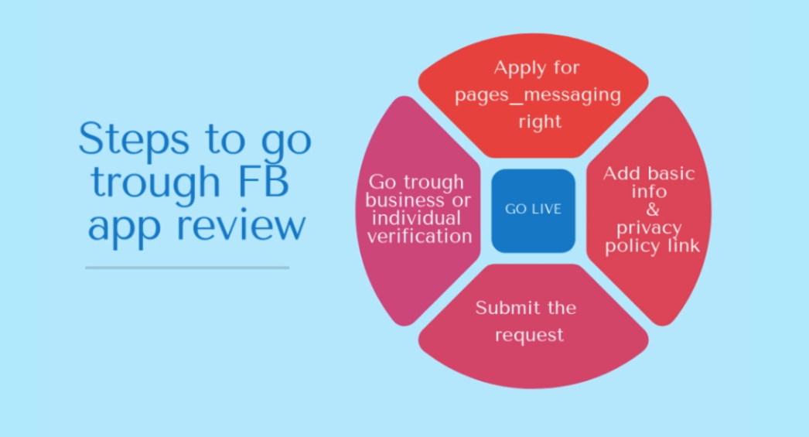

### Publish a chatbot - 7.1.2020:

This section isn't going to be documented as well as the other ones, because it's irrelevant. I'm still watching through the videos, but due to the simple fact the work happens on facebook and not Dialogflow, I'm only going to add some rough information.

To publish a chatbot on Facebook your chatbot is going to be reviewed by facebook. To get through the review you need to:

+ specify what data is going to be requested by the bot
+ describe for what the data is going to be used
+ general information about the side (image, description)

Facebook lets yourself choose which rights you chatbot is going to use, like pages_messaging: lets you site send and recive messages.

